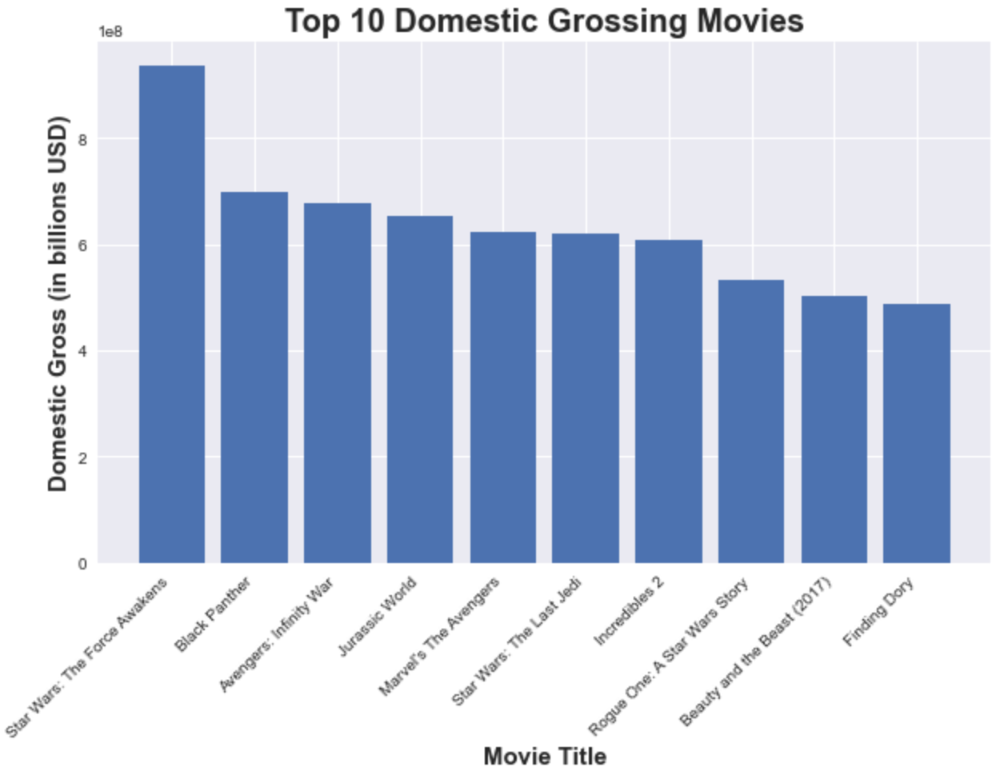
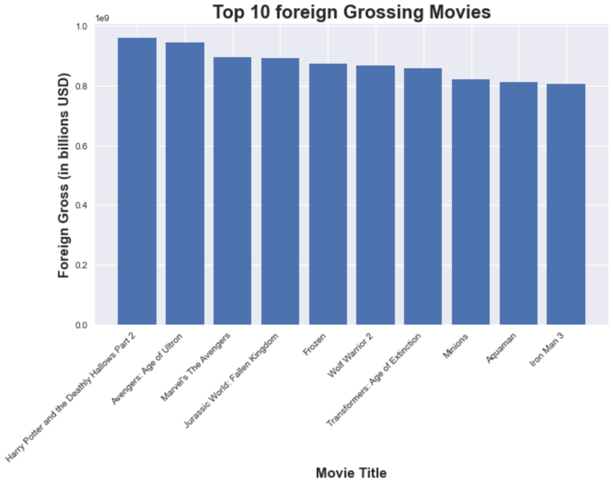
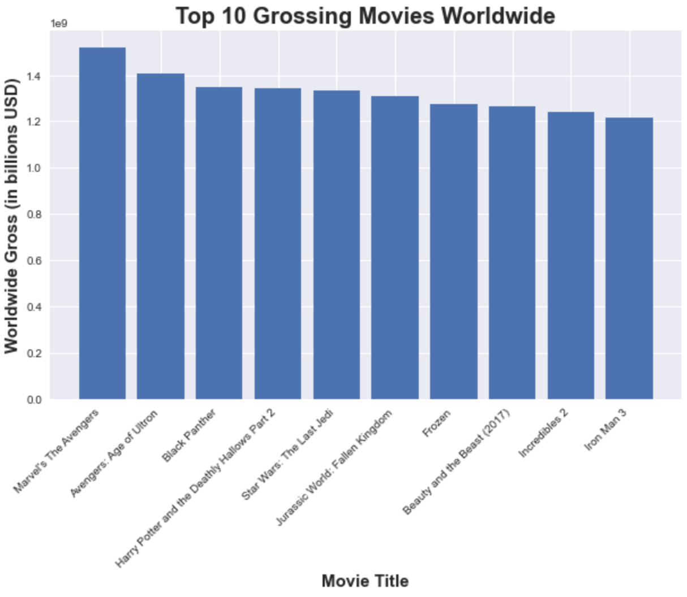
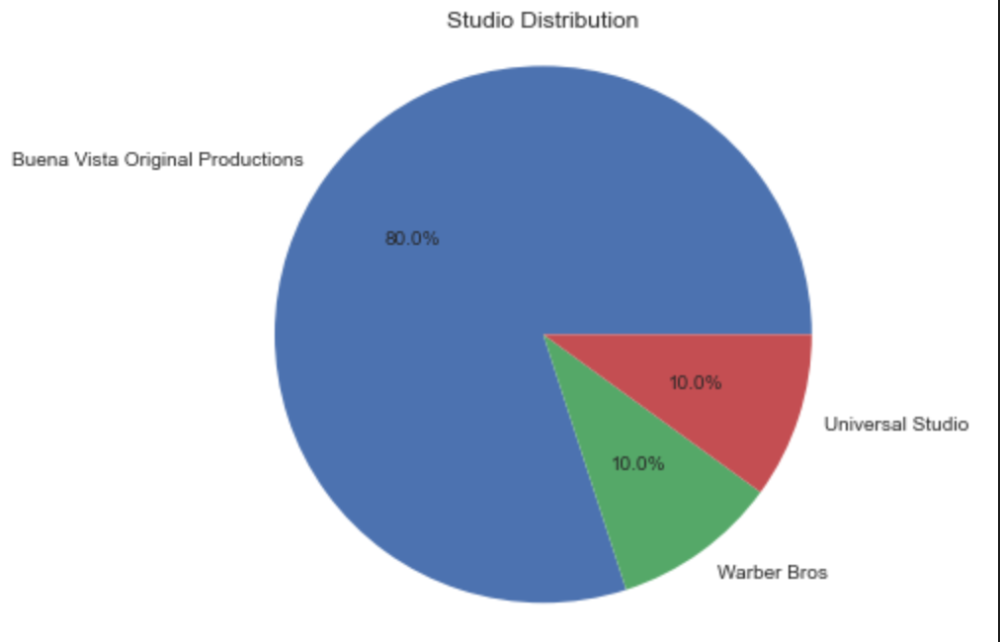
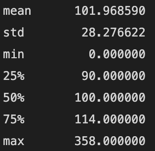
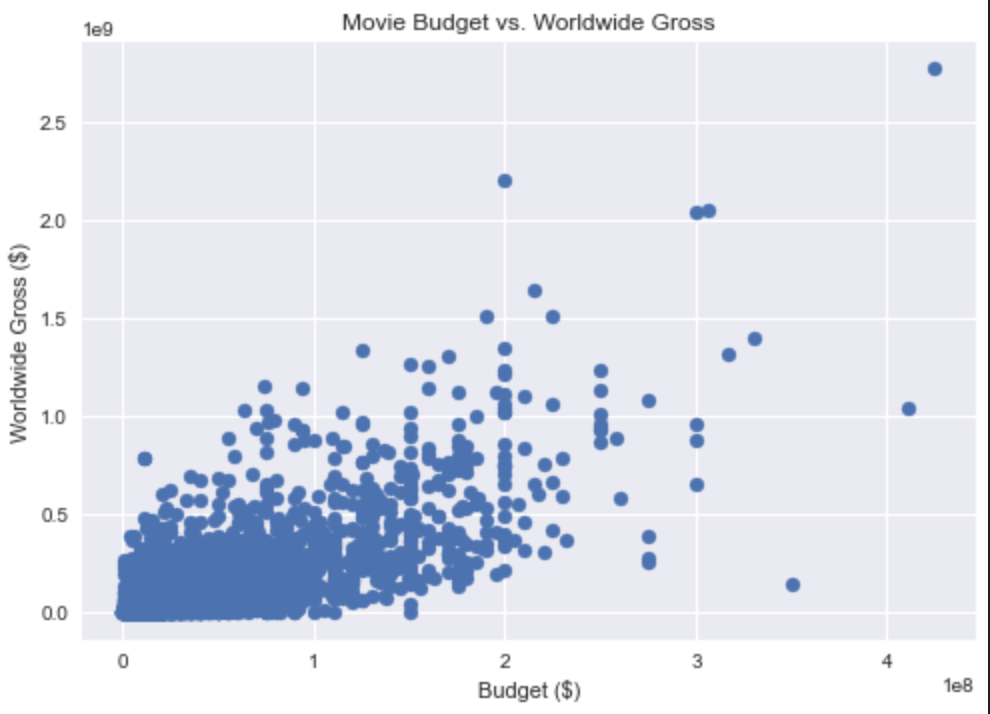

# MICTOSOFT MOVIE STUDIO PROPOSAL ANALYSIS

**Author:** Victoria Mwendwa Nabea

# Overview
Microsoft is interested in creating a new movie studio to compete with other big companies that are creating original video content. However, Microsoft has limited knowledge about creating movies. To help the head of Microsoft's new movie studio make informed decisions about the type of films to create, the company needs to explore the types of films that are currently doing well at the box office. This exploration will provide actionable insights that will guide the company's decision-making process regarding the creation of new films. By analyzing the current trends and success factors in the film industry, Microsoft will be better positioned to make informed decisions that will enable them to succeed in the highly competitive market.

# Business Problem
Microsoft wants to create a movie studio but lacks knowledge about creating movies. I will explore the most successful types of films at the box office and provide insights to guide the head of the new movie studio in deciding what type of films to create.

# Data
To conduct the analysis on the most successful types of films at the box office, I obtained data from various sources on the internet. These sources include the TMDB dataset, BOM movies, reviews, and movie budgets. These datasets provide information on box office revenues, movie budgets, and other relevant information that can help identify successful film genres and provide actionable insights for Microsoft's new movie studio.

# Methods
To analyze the data and identify successful film genres, various methods were used. The analysis involved examining box office revenues, movie budgets, and other relevant information, such as genre and release date. Statistical analysis was performed to identify patterns and trends in the data. These methods allowed for a comprehensive analysis of the data and provided actionable insights to guide Microsoft's decision-making process for creating successful films.

# Results
## 1. From the analysis, it shows that the sci-fi genre doing pretty well in the local market.

## 2. The foreign markets show a higher potential market for action/adventure films

## 3. From the analysis, three genres are prominent in income generation worldwide. They are the action/adventure, SciFi and fantasy genres. 

## 4. This pie chart indicates that Buena Vista Original Production studios have produced a larger number of the highest grossing movies worldwide

## 5. This statistic was calculated using the movie runtimes in minutes. Average movie runtime from the dataset is 101 minutes. 

## 6. An average of 3000 movies have been released per year since 2010 to 2018. the bae graph indicates an upward but not linear growth of the graph

## 7. This diagram shows the correlation between a movies ratings and its popularity. This indicates a very strong correlation meaning that, the more popular a movie is, the higher the rating the movie gets.

## 8. The scatter plot diagram shows the relationship between the production budget and the gross income in dollar billions that a movie generates. It is a positive relationship meaning that the higher the investment in a movie, the more likely it is to generate higher incomes, 

# Reccomendations
**After the analysis, these would be the data driven recommendations we would give:**

Focus on the top grossing genres going well in the international market which include the Action/Adventure, Fantasy and Sci-Fi. Microsoft should also look into partnering with Buena Vista productions studio or do thorough benchmarking to get advise and guidance from the best in the game of movie production.

When making movies, consider runtimes of 100 – 120 minutes. We have drawn this insight from the average runtimes computation, meaning it suits most of the audience.

Since there are averagely 3000 movies released annually, investing on proper marketing to popularize the movies will help rate their movies among the top hence gaining a positive reputation on the brand and a bigger audience.

Lastly, money begets money! The higher the investment on movie budget, the higher the return on investment. We should start looking at an around half a billion dollars in order to be among the top.

## Summary
After analyzing the data obtained from various sources such as the TMDB dataset, BOM movies, reviews, and movie budgets, several insights were identified to guide Microsoft's decision-making process for creating successful films. The analysis showed that the most successful genres at the box office were action, adventure, and science fiction. The analysis also highlighted the importance of having a high production budget for successful films. These findings provide actionable insights to guide Microsoft's new movie studio in creating successful films and competing in the highly competitive movie industry.